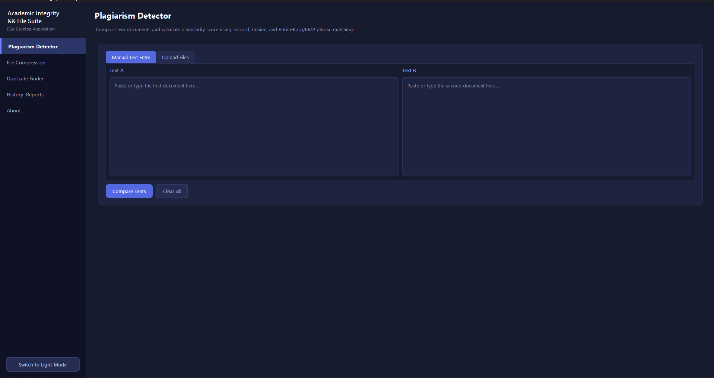
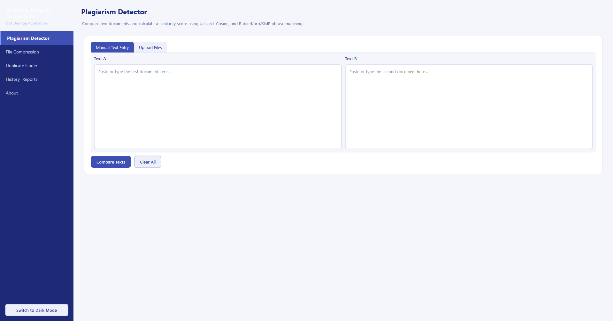
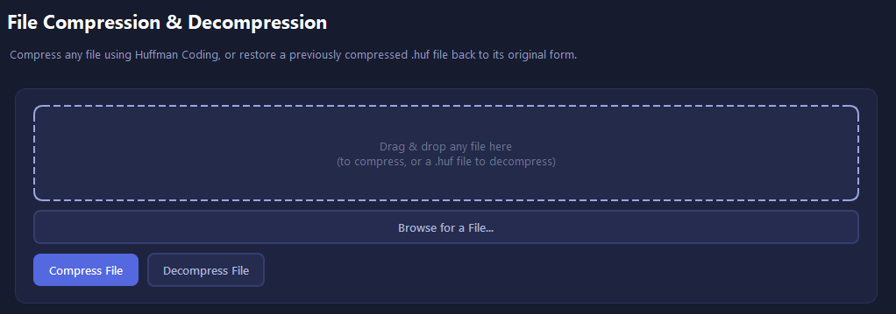
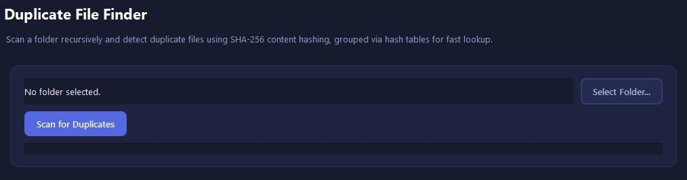
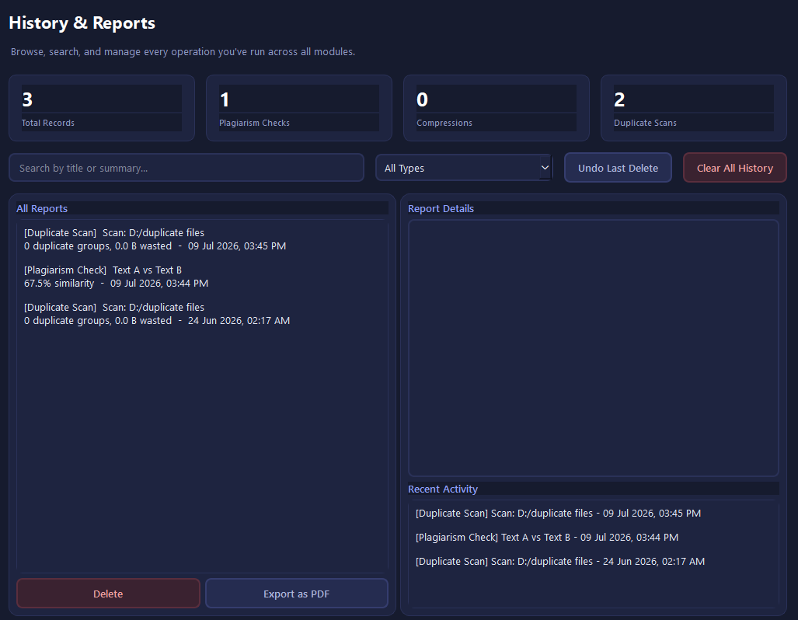
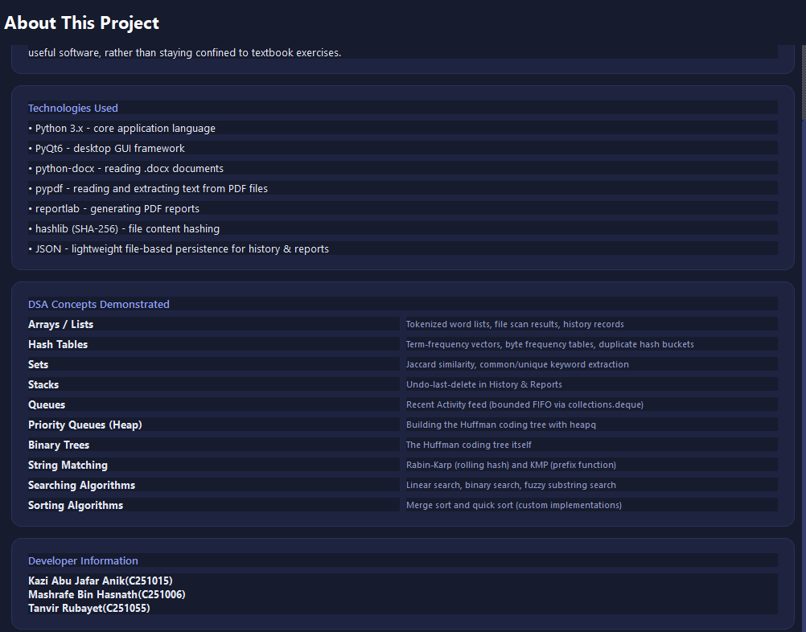

# 📂 File Analysis & Integrity Suite

<p align="center">
  <b>A modern Python desktop application demonstrating real-world applications of Data Structures & Algorithms.</b>
  <br><br>
  Built with <b>PyQt6</b>, the application provides plagiarism detection, Huffman-based file compression, duplicate file detection, history management, and PDF report generation in a clean, modern interface.
</p>

---

## ✨ Features

### 📝 Plagiarism Detector
- Compare text manually or upload documents.
- Supports **TXT, DOCX, and PDF** files.
- Calculates document similarity using:
  - Jaccard Similarity
  - Rabin-Karp Algorithm
  - Knuth-Morris-Pratt (KMP)
- Highlights similarity percentage.
- Generates detailed reports.

---

### 📦 File Compression
- Compress files using **Huffman Coding**.
- Decompress previously compressed `.huf` files.
- Reduces file size efficiently.
- Drag & Drop file support.

---

### 📁 Duplicate File Finder
- Scan folders recursively.
- Detect duplicate files using **SHA-256 hashing**.
- Organize duplicates into groups.
- Fast lookup using **Hash Tables**.

---

### 📊 History & Reports
- Stores all operations automatically.
- Search previous reports.
- Filter by operation type.
- Export reports as PDF.
- Undo deleted history records.

---

### 🎨 Modern User Interface
- Dark & Light mode.
- Responsive desktop layout.
- Clean navigation sidebar.
- User-friendly workflow.

---

# 📸 Screenshots

## Main Interface


---

## Plagiarism Detector

### Dark Mode



### Light Mode



---

## File Compression



---

## Duplicate File Finder



---

## History & Reports



---

## About Page



---

# 🧠 Data Structures Used

| Data Structure | Purpose |
|---------------|---------|
| Arrays / Lists | Token storage and file records |
| Hash Tables | Duplicate file detection and frequency tables |
| Sets | Unique keyword extraction and Jaccard Similarity |
| Stack | Undo delete functionality |
| Queue (Deque) | Recent activity management |
| Priority Queue (Heap) | Huffman Tree construction |
| Binary Tree | Huffman Coding Tree |

---

# ⚡ Algorithms Implemented

| Algorithm | Application |
|-----------|-------------|
| Rabin-Karp | String matching |
| Knuth-Morris-Pratt (KMP) | Pattern searching |
| Linear Search | Record lookup |
| Binary Search | Sorted data searching |
| Merge Sort | Sorting reports |
| Quick Sort | Sorting datasets |
| Huffman Coding | File Compression |
| SHA-256 Hashing | Duplicate file detection |

---

# 🛠 Technologies Used

| Technology | Purpose |
|------------|---------|
| Python 3.x | Core programming language |
| PyQt6 | Desktop GUI |
| python-docx | Read DOCX documents |
| pypdf | Read PDF documents |
| reportlab | Generate PDF reports |
| hashlib | SHA-256 hashing |
| JSON | Persistent storage |

---

# 📁 Project Structure

```text
File-Analysis-Integrity-Suite/
│
├── assets/
├── reports/
├── history/
├── compression/
├── plagiarism/
├── duplicate_finder/
├── ui/
├── main.py
├── requirements.txt
└── README.md
```

---

# 🚀 Installation

Clone the repository

```bash
git clone https://github.com/yourusername/File-Analysis-Integrity-Suite.git
```

Move into the project

```bash
cd File-Analysis-Integrity-Suite
```

Install dependencies

```bash
pip install -r requirements.txt
```

Run the application

```bash
python main.py
```

---

# 📚 DSA Concepts Demonstrated

- Arrays
- Lists
- Hash Tables
- Sets
- Stack
- Queue
- Heap
- Binary Tree
- Searching Algorithms
- Sorting Algorithms
- String Matching
- Huffman Coding
- Hashing

---

# 🎯 Learning Objectives

This project demonstrates how Data Structures and Algorithms can be applied to solve practical software engineering problems rather than only textbook exercises.

Key concepts include:

- Efficient searching
- Pattern matching
- File compression
- Hash-based duplicate detection
- Tree-based encoding
- Report generation
- Persistent data management

---

# 👨‍💻 Developers

- **Kazi Abu Jafar Anik** *(C251015)*
- **Mashrafe Bin Hasnath** *(C251006)*
- **Tanvir Rubayet** *(C251055)*

---

# 📄 License

This project was developed for educational purposes as part of the **Data Structures & Algorithms** course.

---

<p align="center">
⭐ If you found this project interesting, consider giving it a star!
</p>
